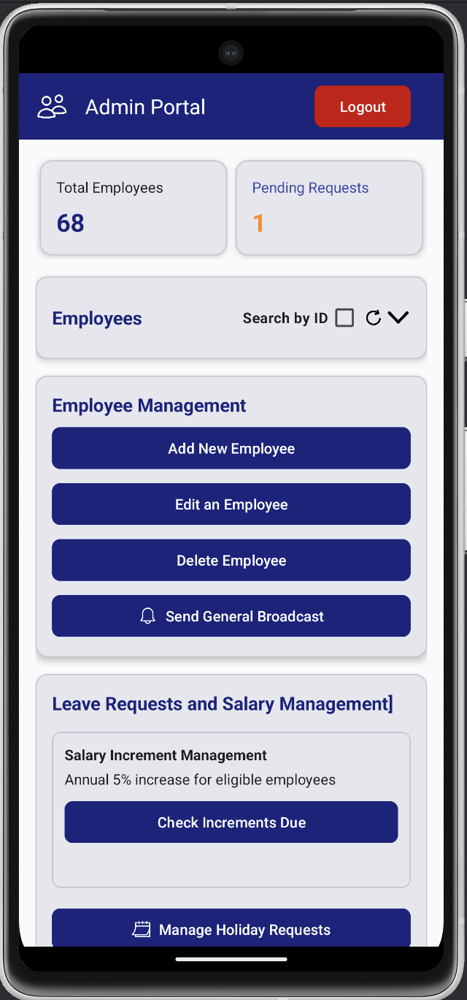

# StaffSync

An Android app for managing employee data and leave requests. Built for COMP2000 Software Engineering 2 using Java, XML and the *comp2000* REST API.

## Features

### Admin Side



- Manage employee records
- Handle leave approvals
- Automatic 5% yearly salary increments
- Search & filter employees
- Push notifications
- General broadcasts

### Employee Side


- Submit leave requests
- View leave history
- Edit profile
- Privacy settings
- Terms & Documentation
- **Dark mode**

## Setup

1. Open Android Studio
2. Clone the repository(*Get from Version Control*):

`https://github.com/alfie-ns/staffsync-app`

3. Sync Gradle files in the file menu
4. `Control + R` to run the app

## Login

Main Admin credentials:

```
Email: alfie@staffsync.com
Password: alfie123
```

## Tech Stack

- Uses worker thread for API calls;  keeps UI responsive
- SQLite for offline data
- Push notifications via NotificationService
- Material Design components (buttons, cards, etc)

Links

- [API Documentation](docs/api-documentation.md)
- [Project Report](coming-soon)
- [Set Exercise Repoisitory](https://github.com/Plymouth-COMP2000/set-exercises-alfie-ns)

Made for **COMP2000** by *alfie-ns*
