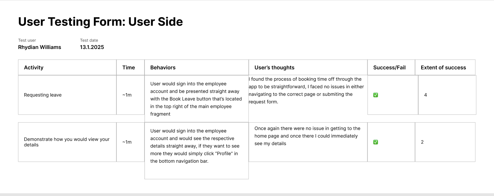
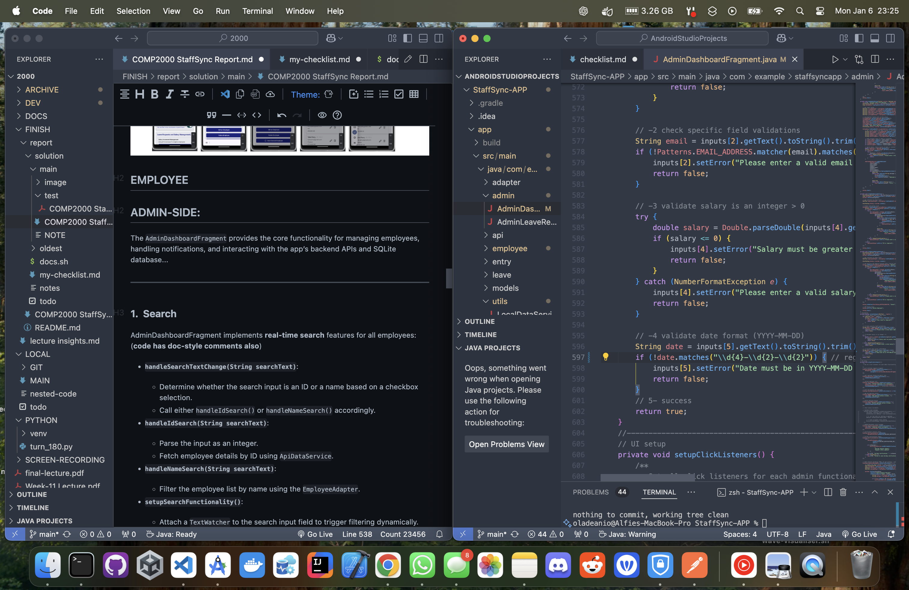

# COMP2000 StaffSync Report(alfie-ns')

# Table of Contents

1. [Introduction](#introduction)
2. [UML Diagrams](#uml-diagrams)
   - [Admin-SIDE](#admin-side)
   - [User-SIDE](#user-side)
3. [Background](#background)
4. [Legal, Social, Ethical, and Professional Considerations](#legal-social-ethical-and-professional-considerations)
   - [Privacy Considerations](#privacy-considerations)
   - [Data Integrity](#data-integrity)
   - [Security Measures](#security-measures)
5. [Design](#design)
6. [Implementation](#implementation)
   - [Core Functionalities](#core-functionalities)
   - [Admin-SIDE](#admin-side-1)
   - [Employee-SIDE](#employee-side)
7. [Insight](#insight)
   - [Adapter](#adapter)
   - [Admin](#admin)
   - [API](#api)
   - [Employee](#employee)
   - [Entry](#entry)
   - [Leave](#leave)
   - [Models](#models)
   - [Utils](#utils)
8. [Normal and Dark Mode Themes](#normal-and-dark-mode-themes)
   - [Normal Theme](#normal-theme)
   - [Dark Mode](#dark-mode)
9. [Evaluation](#evaluation)
10. [Summary](#summary)
11. [References](#references)

## Introduction

StaffSync is a mobile application developed for the COMP2000 Software Engineering 2 module; this report documents the development process; the app aims to create a practical employee management system that serves both administrative staff and employees through a mobile interface.

The application interfaces with the comp2000 RESTful API to manage employee data, handle leave requests for both admin and user accounts; provides notifications for various system events.

The application interfaces with the comp2000 RESTful API to provide user notifications, manage employee data, and  handle leave requests for both admins and users. The app is designed to be user friendly and efficient, with a focus on ease of use and functionality.

The source code and development evidence in the commits are available at the follow [GitHub Repository Link](https://github.com/alfie-ns/staffsync-app)

The video is a YouTube video with the link [here](https://youtu.be/0pynDBs9QmY)

## UML Diagrams

### Interaction Diagram

The following diagrams illustrate the interaction between the app's components and the user. The Admin diagram shows how an admin would interact with the app, while the employee diagram illustrates an employee would interact.

**Admin interaction diagram**


**Employee interaction diagram**


### Entity Relationship Diagram

**Login**

- When a user logs in the isAdmin field determines if it is an admin or an employee

**User**

- A user has unique UserId and email fields for identification
- Passwords are stored as hashed strings


## Background

StaffSync was developed for the COMP2000 assignment to create an android based employee management system. The application is designed for two types of users:

**administrators** who manage employee records and **staff members/employees** who need to access their own information and submit leave requests.

The system provides:

- Employee profile management;
- Leave request handling with automated notifications;
- Salary tracking with automatic yearly increases;
- User preference management;

The target users are office administrators who need quick access to employee records, and staff members who manage their details and leave requests through their phone.

## Legal, Social, Ethical, and Professional Considerations

An important part of the development process was considering the legal, social, ethical, and professional implications of the application. These considerations help ensure that the application is compliant with relevant legislation, respects user privacy, and maintains ethical standards.

Firstly, there are the legal considerations, and a prime example of the kind of legislation that I needed to consider is the general data protection regulation (GDPR) which is a legal framework that sets guidelines for the collection and processing of personal information of individuals. The GDPR sets out the principles for data management and the rights of the individual, while also imposing fines for any failings. The General Data Protection Regulation covers all companies within its jurisdiction, so it is a critical regulation for all applications to comply with. Therefore, it was vital that this project was compliant with all relevant legislation including GDPR to avoid any legal issues.

Along with the legal considerations of developing an app there are also significant social implications that need to be considered. By automating HR tasks and providing a mobile interface for employees, StaffSync can have several positive effects on the workplace including:

- The Automation of HR tasks. This can reduce the workload for administrative staff and improve efficiency in managing employee records.
- The reduction of the workload for administrative staff can free up time for more strategic tasks.
- The provision of a mobile interface for employees can improve accessibility and convenience for staff members/employees.

Along with the legal and social implications, the application also raises ethical concerns related to employee privacy and fairness. Some of the ethical considerations include:

### Privacy Considerations

- Employee data protection

  - The application handles sensitive personal information including salaries and joining dates
  - All data is transmitted securely through HTTPS
  - Users can only access their own information
  - Administrators have restricted access based on their role

### Data Integrity

- Ensuring accurate employee records

  - Input validation on all forms
  - Audit trail of changes
  - Automatic salary calculations to prevent manual errors

### Security Measures

- Authentication and authorisation

  - Secure login system; when admin creates a new employee, on the first-time login, the employee will change the password to what THEY want, it's initially autocreated as EMP{employeeId}
  - Session management
  - Protection against common mobile app vulnerabilities
  - Regular security updates

The final component of LSEP is ensuring that Professional standards are met which meant following best practices such as:

- Regular code commits
- Clean code principles
- Comprehensive documentation
- Testing procedures i.e. logging**

## Design

Below are the *storyboards* for employee and admin interfaces, illustrating the key functionalities and user interactions in the StaffSync app.


In lecture 11 (**Threading Design**), you talked about how "*Performing long operations in the main thread will block the whole UI*" and how "*You must do all manipulation to your user interface from the UI thread*", therefore in my solution,  I created an ApiWorkerThread to handle the API network operations and to prevent UI blocking and achieve a greater degree of optimisation.

In lecture 7 (**RecyclerView Implementation**) you talked about how the "*RecyclerView recycles individual elements... When an item scrolls off screen, RecyclerView doesn't destroy its view. Instead, RecyclerView reuses the view for new items*", therefore in my solution I used RecyclerViews for efficient dynamic lists.

In lecture 7 (**ViewHolder Pattern**) you talk about how to use ViewHolder pattern for "Optimizing view lookups" therefore in my solution I constantly use ViewHolders when defining the extended RecyclerView.

## Implementation

The nested functions encapsulate related functionality and maintain scope where it's actually used; the functions don't need to be accessed anywhere else in the app, so they're kept within their parent function where they're called. This also allows the same function names to be reused without conflicts.

Each adapter in adapters/ handles RecyclerView data binding:

1. EmployeeAdapter: Binds employee records to admin dashboard list items, handles search filtering and employee actions (delete/update)
2. LeaveRequestAdapter: Binds leave requests to admin review interface, manages approve/deny actions
3. LeaveHistoryAdapter: Binds leave history to dialog list, formats dates (yyyy-MM-dd to dd MMM yyyy), handles status colors (green/red/gray), and enables history item removal

**Core functionalities**

- ViewHolder pattern implementation (LeaveHistoryAdapter, EmployeeAdapter, LeaveRequestAdapter);
- List item view inflation (EmployeeAdapter, LeaveHistoryAdapter, LeaveRequestAdapter);
- Data binding (LoginFragment, EmployeeMainBodyFragment, AdminDashboardFragment, EmployeeSettingsFragment, EmployeeProfileFragment, LeaveRequestFragment)

**Required functionalities**

**ADMIN-SIDE**

- [X] As an administrator I wish to add employees’ details
- [X] As an administrator I wish to check the employees’ details have been uploaded.
- [X] As an administrator I wish to edit employees’ details.
- [X] As an administrator I wish to delete an employee’s details.
- [X] The app should also apply an automatic increment by 5% on the employee salary when they(tested)

**EMPLOYEE-SIDE**

- [X] As an employee I wish to book/ manage my annual leave/ holiday (the allowance is 30 days)
- [X] As an employee I wish to edit my details.
- [X] As an employee I wish to view my details.

**GENERAL**

- [X] Leave requests with notifications for both sides
- [X] Salary increment(tested turned off now, but think it works)

## INSIGHT

Low-level documentation is in the comments

### ADAPTER

The EmployeeAdapter, LeaveRequestAdapter, and LeaveHistoryAdapter classes manage RecyclerView lists for employees, leave requests, and leave history in the AdminDashboardFragment, AdminLeaveRequestsFragment, and UserSettingsFragment, respectively. They extend RecyclerView.Adapter and provides the necessary methods i.e. onCreateViewHolder(), onBindViewHolder(), getItemCount(), and getItemViewType() to handle list item creation, data binding, and view recycling to bind employee data to the list items, handle user interactions, and update the UI accordingly.

### ADMIN

The AdminDashboardFragment is the core of the admin-side functionalities, providing the main interface for managing employees, handling leave requests, and quickly interacting with the app’s backend APIs and SQLite database. The fragment is responsible for:

- **Employee Management**: Employee Management: Fetching and displaying employee records using fetchAndShowEmployees() (which calls getAllEmployees()), and updating employee records using updateEmployee() (called within showUpdateDialog()) to interact with the API
- **Search Functionality**: Real-time search for employees by ID or filtered name using handleIdSearch() and handleNameSearch() respectively.
- **Leave Request Handling**: Approving or denying leave requests submitted by the user using the respective functionality in the AdminLeaveRequestsFragment i.e. loadRequests and onApprove or onDeny.

### API

The ApiDataService class is the core utility for handling API requests in the app. It abstracts the network operations using Volley and provides methods to interact with the comp2000 REST API through endpoints like getAllEmployees(), getEmployeeById(), addEmployee(), updateEmployee(), deleteEmployee(), and checkHealth(). The class creates an ApiWorkerThread for background processing, which manages task queues and threading to prevent UI blocking. The ApiWorkerThread handles all operations in the background using a BlockingQueue pattern and safely posts results back to the main thread via Handler.

For handling responses and errors, ApiDataService uses JSONObject/JSONArray for parsing and implements callback interfaces (like EmployeeFetchListener, EmployeeAddListener) to communicate results. Network operations are queued and managed through the lifecycle to ensure proper sequencing and resource cleanup. When the API is unavailable, the service integrates with OfflineSyncManager to queue failed requests for later retry, thus maintaining data integrity even during connectivity issues.

All together, these components work to ensure network operations don't block the main thread; failed network calls can be retried later; operations happen in the correct order, and system resources are properly managed. This creates a robust system that handles both immediate API responses and offline scenarios effectively.

ApiWorkerThread executes tasks in the background and communicates results through a Handler mechanism:

- Tasks run on a dedicated background thread;
- Results are posted to the main thread via Handler;
- UI updates only occur on the main thread through callbacks;
- Proper thread safety is maintained throughout the process;

### EMPLOYEE

#### Date Calculation Verification

The logs verify correct date handling for employee ID **3228** and correct responses for the API calls:

##### Successful API Call for Employee ID 3228:

```text
2025-01-14 02:22:55.890  9358-9358  ApiDataService          com.example.staffsyncapp             D  getEmployeeById: Response received on thread: main
2025-01-14 02:22:55.890  9358-9358  ApiDataService          com.example.staffsyncapp             D  API response: {"department":"Sales","email":"tom_west@user.com","firstname":"Tom","id":3228,"joiningdate":"Tue, 05 Apr 2022 00:00:00 GMT","lastname":"West","leaves":30,"salary":"100000.00"}
```

The **system** retrieves and processes the `joiningdate` and `salary` values correctly. The data aligns with the employee's hire anniversary, ensuring correct increment calculations.

**Succesful API Call for Employee ID 3239:**

```text
2025-01-14 02:25:54.295  9358-9358  ApiDataService          com.example.staffsyncapp             D  getEmployeeById: Response received on thread: main
2025-01-14 02:25:54.295  9358-9358  ApiDataService          com.example.staffsyncapp             D  API response: {"department":"Sales","email":"bob_west@user.com","firstname":"Bob","id":3239,"joiningdate":"Fri, 11 Nov 2022 00:00:00 GMT","lastname":"West","leaves":30,"salary":"60000.00"}
```

The system handles the joiningdate and salary fields for Employee ID 3239 accurately, with service time and next increment date calculated correctly.

**Network Errors (404):**
API sync attempts for Employee ID 3239 resulted in intermittent 404 errors due to an invalid endpoint:

```text
2025-01-14 02:22:37.256  9358-9358  ApiDataService          com.example.staffsyncapp             E  Network Error (Code 404)
2025-01-14 02:22:37.290  9358-9358  EmployeeSync            com.example.staffsyncapp             E  API sync failed: Network Error (Code 404)
```

**Service Time and Increment Calculation:**
The logs confirm that the system calculates service time and the next salary increment date:

```text
2025-01-14 02:25:54.319  9358-9358  EmployeeData            com.example.staffsyncapp             D  Hire date: 2022-11-11
2025-01-14 02:25:54.319  9358-9358  EmployeeData            com.example.staffsyncapp             D  Service time: 2y 2m
2025-01-14 02:25:54.319  9358-9358  DateCheck               com.example.staffsyncapp             D  Now: 2025-01-14
Hire: 2022-11-11
Next: 2025-11-11
```

All of these logs verify that the date and salary data are processed correctly for valid employee records with increment scheduling.

The Employee system consists of multiple components working together; at its core is the Employee model class with defines the basic employee atttibutes (id, firstname, lastname, email, department, salary, joiningdate). Employee data is managed through several key fragments: EmployeeMainBodyFragment acts as the main dashboard, EmployeeProfileFragment handles profile viewing/editing, and EmployeeSettingsFragment manages user preferences. These fragments use ViewBinding for UI management and interact with both the LocalDataService for local storage and ApiDataService for server operations. Navigation between employee screens is handled by NavigationManager using a bottom-navigation bar. The employee system also includes leave management functionality through LeaveRequestFragment and LeaveHistoryDialog, allowing employees to submit and track leave requests.

### ENTRY

The StartUpFragment is a good place to have the /health check; therefore, the user can instantly know if the API-related functionality is going to work from the start. The entry system consists of two main fragments: StartUpFragment which handles API health checking and initial app entry, and LoginFragment which manages user authentication. The LoginFragment handles both employee and admin login through LocalDataService, implements security measures like login attempt tracking and account lockouts, and manages password visibility. The fragment also creates test accounts on first run and uses ViewBinding for UI management. Together these fragments ensure users can verify API connectivity and securely access their appropriate dashboard

### LEAVE

The Leave system manages employee leave requests through two main components: LeaveRequestFragment which handles new leave submissions and LeaveHistoryDialog which displays request history. The LeaveRequestFragment implements date validation (ensuring requests are 7+ days in advance and max 14 days), leave balance checking, and automatic admin notifications. The LeaveHistoryDialog uses a RecyclerView with LeaveHistoryAdapter to display past requests chronologically. Both components interact with LocalDataService for data persistence and NotificationService for alerts. The system uses ViewBinding for UI management and maintains a clearly defined LeaveRequest model class.

### MODELS

The Models package consists of two core data classes: Employee and LeaveRequest. The Employee model manages essential employee information (id, firstname, lastname, email, department, salary, joiningdate) with appropriate getters and a helper method for combining first and last names. The LeaveRequest model handles leave application data (id, employeeId, employeeName, dates, reason, status) and includes tracking for admin responses and request status through a set of getters and setters.

### UTILS

The Utils package contains core service classes that support the app's functionality. LocalDataService manages SQLite operations, handling authentication, leave requests, and employee data persistence through a defined database schema. NotificationService manages push notifications across three channels (admin, holiday, system) with different priorities. NavigationManager handles bottom navigation for employee screens. SalaryIncrementManager processes automatic 5% salary increases after one year. OfflineSyncManager ensures API operations can be queued and processed when connectivity is restored.

### Offline Functionality

For users of the app, there is some offline functionality; the local data service is an SQLite database class which updates stuff locally, without the need for the comp2000 REST API to do everything at the moment of time; regarding the comp2000 API, actions can be queued to be done later once the connection is resolved, with OfflineSyncManager, a core utility to ensure uninterrupted API-related functionality.

- **OfflineSyncManager** works by monitoring network activity using Android’s ConnectivityManager. It initialises a NetworkCallback object and registers it with a NetworkRequest. When the network is lost, the onLost() method is called, and the isNetworkAvailable LiveData is updated with false, ensuring UI components observing this LiveData can reflect the network’s unavailability; when the onAvailable() method of the callback is triggered, indicating that the network is now available, the isNetworkAvailable MutableLiveData is updated with true, thus triggering the processQueue() method to start processing queued tasks.
- Tasks requiring API actions are queued during network outages. These actions are stored in the local SQLite database as JSON objects, ensuring no user actions are lost. When the network connection is restored, the **OfflineSyncManager** retrieves these queued tasks from the database and processes them using the **ApiDataService**. This ensures that all pending actions are executed seamlessly, providing a reliable experience even in environments with intermittent connectivity.

---

## ADMIN-SIDE:

The `AdminDashboardFragment` provides the core functionality for managing employees, handling notifications, and interacting with the app’s backend APIs and SQLite database...

---

### **1.  Search**

AdminDashboardFragment implements **real-time search** features for all employees:(**code has doc-style comments also**)

- **`handleSearchTextChange(String searchText)`**:

  - Determine whether the search input is an ID or a name based on a checkbox selection.
  - Call either `handleIdSearch()` or `handleNameSearch()` accordingly.
- **`handleIdSearch(String searchText)`**:

  - Parse the input as an integer.
  - Fetch employee details by ID using `ApiDataService`.
- **`handleNameSearch(String searchText)`**:

  - Filter the employee list by name using the `EmployeeAdapter`.
- **`setupSearchFunctionality()`**:

  - Attach a `TextWatcher` to the search input field to trigger filtering dynamically.

---

### **2. Employee Management**

This provides the functionality for adding, updating, and deleting employee records:

- **`setupEmployeeAdapter(List<Employee> employees)`**:

  - Configure the `RecyclerView` adapter for displaying employees;
  - Set up listeners for update and delete actions.
- **`fetchAndShowEmployees()`**:

  - Fetch all employees via `ApiDataService`;
  - Update the adapter and UI components with the fetched data.
- **`searchEmployeeById(int id)`**:

  - Fetch employee details by ID from the API.
  - Update the `RecyclerView` with the filtered employee list.

---

### **3. Dialog Management**

There are various dialogs that handle user inputs and interactions:

- **`showAddEmployeeDialog()`**:

  - Display a form for adding a new employee.
  - Validates inputs and sends the data to the API.
- **`showUpdateDialog(Context context, Employee employee)`**:

  - Populate fields with the employee’s current details.
  - Update the employee record on submission.
- **`showDeleteEmployeeDialog()`**:

  - Accept the employee ID and deletes the respective record using the API.

I didn't make the functionality to change notifications as the admin should always been notified regardless of what they want

---

### **4. Notification Handling**

This fragment incorporates notification features to enhance usability:

- **`notificationService`**:

  - Send notifications for actions like holiday requests and system updates.
- **`binding.notificationSwitch`**:

  - Toggle email notifications.
- **`notifyEmployee(int employeeId, boolean isApproved)`**:

  - Send an approval/denial message to an employee regarding their leave request.

---

### **5. Salary Increment Management**

- **`showIncrementDialog(String message, int eligibleCount)`**:

  - Display the status of eligible employees for salary increments.
- **`SalaryIncrementManager`**:

  - Fetch and calculates increment eligibility based on hire date.

---

### **6. UI and State Management**

- **`toggleEmployeeList()`**:

  - Toggle the visibility of the employee list with animations.
- **`updateEmployeeListVisibility()`**:

  - Adjust the visibility of the employee list based on toggle state.
- **[ ] Shared Preferences**:

  - Store states like list visibility and notification toggles for persistence.

---

### **7. Admin-Specific Features**

- **Holiday Management**:

  - Provide leave approval and denial workflows via the `AdminLeaveRequestsFragment`.
- **Broadcast Messaging**:

  - Send announcements to all employees via the `notificationService`.
- **Logout Functionality**:

  - Clear admin session data and navigates to the login screen.
- Searching with a filtered employee list using the filter() method; case-insensitive search by name and search by employeeId; with this RecyclerView Search filter, the admin can seamlessly monitor and manage employee records.
- Handling API requests through a dedicated worker thread
- ApiWorkerThread provides a generic background processing mechanism through BlockingQueue. While primarily used by ApiDataService for API operations, it can handle any Runnable task that needs to run off the main thread. The worker thread manages task queues, executes operations in the background, and safely communicates results back to the main thread via Handler.

## EMPLOYEE-SIDE

### Nav Bar

The bottom-navigation bar is implemented using the NavigationManager class, in particular, the setupBottomNavigation() function which handles navigation between each employee-fragment defined in bottom_nav_menu.xml, that defines the respective icons and titles.

### Privacy Settings + Terms & Documentation

The privacy settings dialog is a dialog that is opened upon clicking on the Privacy Settings button located in the Employee settings fragment; it is ...

### Light and Dark Mode Themes

The normal theme in the `themes.xml` file represents the default colours for the app when it is in light mode or when dark mode is enabled. These colours are static and provide a consistent visual experience for users in a light environment.

### **Style**

The default light mode is styled using the `Base.Theme.StaffSyncApp`; it extends `Theme.Material3.DayNight.NoActionBar`. The configuration is as follows:

```xml
<resources xmlns:tools="http://schemas.android.com/tools">
    <!-- Base application theme. -->
    <style name="Base.Theme.StaffSyncApp" parent="Theme.Material3.DayNight.NoActionBar">
        <!-- primary brand colour -->
        <item name="colorPrimary">@color/teal_deep</item>
        <item name="colorPrimaryVariant">@color/teal_medium</item>
        <item name="colorOnPrimary">@color/white</item>
  
        <!-- secondary brand colour -->
        <item name="colorSecondary">@color/teal_medium</item>
        <item name="colorSecondaryVariant">@color/teal_light</item>
        <item name="colorOnSecondary">@color/black</item>
  
        <!-- status bar colour -->
        <item name="android:statusBarColor">@color/teal_deep</item>
    </style>

    <style name="Theme.StaffSyncApp" parent="Base.Theme.StaffSyncApp" />
</resources>
```

### **Key Attributes in Normal Theme**

While turquoise is my personal preference for a color, teal was chosen as the primary theme color for the employee-side application due to its suitability for professional environments. This decision aligns with industry standards for creating visually appealing and professional user interfaces.

1. **Primary**
   - `@color/teal_deep`: primart main colour.
   - `@color/teal_medium`: lighter colour; complementary elements.
   - `@color/white`: used for text and icons on primary-coloured backgroundsm sometimes
2. **Secondary**
   - `@color/teal_medium`: provides secondary accents.
   - `@color/teal_light`: adds subtle highlights.
   - `@color/black`: used for text and icons on -econdary-coloured backgrounds.
3. -*Status Bar Colour**
   - `@color/teal_deep`: ensures consistency across the interface.

### **Comparison with Dark Mode**

The dark mode (`theme-night`) adjusts these colours to darker, more eye-friendly tones, such as:

* `@color/neutral_background_dark` instead of light backgrounds like `@color/white`.
* `@color/teal_medium_dark` instead of `@color/teal_medium` for primary elements.

The normal theme defines a static light mode setup, it works in tandem with the dark mode theme to provide a cohesive user experience. These attributes ensure visual consistency and usability in bright environments.

### **Dark Mode**

I implemented a dark mode feature that's toggled in the ``UserSettingsFragment`` and uses the ``theme-night`` file in the ``res/themes`` folder. For each state, it changes the theme attributes as defined in the style and maintains the state for the particular employee; switches off when logged out.

### **Theme-Night Style**

The dark mode is styled using the `Base.Theme.StaffSyncApp`, which extends `Theme.Material3.DayNight.NoActionBar`. The configuration is as follows:

```xml
<style name="Base.Theme.StaffSyncApp" parent="Theme.Material3.DayNight.NoActionBar">
    <item name="android:windowBackground">@color/neutral_background_dark</item>
    <item name="colorPrimary">@color/teal_medium_dark</item>
    <item name="colorOnPrimary">@color/accent_white</item>
    <item name="colorSurface">@color/card_background_dark</item>
    <item name="colorOnSurface">@color/text_primary_dark</item>
    <item name="cardBackgroundColor">@color/card_background_dark</item>
    <item name="android:textColorPrimary">@color/text_primary_dark</item>
    <item name="android:textColorSecondary">@color/text_secondary_dark</item>
    <item name="materialCardViewStyle">@style/CustomCardView</item>
</style>
```

When the user toggles the dark mode switch in the UserSettingsFragment, the app updates the theme to match the user’s preference, making the interface more comfortable for user's eyes in darker environments.

### Layouts

#### Colours

The colours defined in both the normal and dark themes are used layout files to ensure a cohesive design across the app;

the colours are dynamically applied based on the current theme (light or dark), providing a consistent and user-friendly experience.

#### **Normal Theme in Layouts**

1. **`colorPrimary`** (****`@color/teal_deep`****)

   - used for primary elements like **header bars** and **buttons**.
   - ```xml
     <View
         android:id="@+id/header_bar"
         android:layout_width="match_parent"
         android:layout_height="56dp"
         android:background="?attr/colorPrimary" />
     ```
2. **`colorOnPrimary`** (****`@color/white`****)

   - applies to **text** and **icons** displayed on primary-coloured backgrounds.
   - ```xml
     <ImageView
         android:id="@+id/employee"
         android:layout_width="48dp"
         android:layout_height="48dp"
         android:src="@drawable/home_icon"
         app:tint="?attr/colorOnPrimary" />
     ```
3. **`colorSecondary`** (****`@color/teal_medium`****)

   - used for **secondary interactive elements**, like buttons or cards.
   - ```xml
     <com.google.android.material.button.MaterialButton
         android:id="@+id/view_history_btn"
         android:textColor="?attr/colorSecondary" />
     ```
4. **`android:statusBarColor`** (****`@color/teal_deep`****)

   - Consistently applied to the status bar, ensuring alignment with the app’s branding.

#### **Dark Theme in Layouts**

1. **`colorPrimary`** (****`@color/teal_medium_dark`****)

   - Adjust primary elements like **header bars** to **darker tones**.
2. **`colorOnPrimary`** (****`@color/accent_white`****)

   - Ensure **text** and **icons** remain visible, regardless of darker background
3. **`colorSurface`** (****`@color/card_background_dark`****)

   - Applied to **card backgrounds** and other surface-level elements.
     ```xml
     <com.google.android.material.card.MaterialCardView
         android:backgroundTint="?attr/colorSurface" />
     ```

#### **Usage Across Layouts**

- **Employee Layouts**:

  - Header bars use `colorPrimary` and `colorOnPrimary`.
  - Cards and buttons rely on `colorSurface` and `colorSecondary` for styling.
- **Admin Broadcast Dialog**:

  - While primarily using Material Design defaults, elements like buttons can inherit secondary theme colours.
- **Settings Fragment**:

  - Dynamically adapts colours like `colorPrimary` and `colorOnPrimary` when dark mode is toggled, thus ensuring readability and consistency; this adaptation aligns with interaction design principles by providing intuitive mapping between user actions and visual outcomes, as well as clear feedback on the current theme state.

By referencing and thus utilising these themes, the app maintains visual consistency and adapts seamlessly between light and dark modes, enhancing usability by making the interface easier to learn and more effective for users, as outlined in usability principles.

## Evaluation

The user-testing studies are down below:




I don't have many other people I would want to do the user testing study. You may think these are fake but they're not; honestly. These participants are my father and friend, the same people I recruited for my set-exercise testing study and thus have already signed the consent forms; I have no other people I would want to do the user testing study with; my father is a solution architect with 35 years of experience in the industry and Rhydian is a mentor-like figure to me.

The reason this looks so similar to the previous one is I structured it this way on purpose.

**In regards to the functions used:**

#### Authentication

`verifyAdminLogin` and `verifyEmployeeLogin` in *LocalDataService* handle user authentication for Admins and Employees, respectively; `createEmployeeAccount` in LocalDataService manages employee account creation i.e. when an admin creates a new employee; `logoutAdmin` and `logoutEmployee` clear session data and navigate to the login screen.

#### Employee Management

`fetchAndShowEmployees` in AdminDashboardFragment fetches and displays all employees; `updateEmployee` in AdminDashboardFragment updates employee records; `searchEmployeeById` in AdminDashboardFragment fetches employee details by ID; `showAddEmployeeDialog` and `showUpdateDialog` in AdminDashboardFragment handle adding and updating employee records; `showDeleteEmployeeDialog` in *AdminDashboardFragment* deletes an employee record.

#### Offline Sync & Threading

`enqueueTask` and `proceessQueue` handle the offline sync in the *OfflineSyncManager*; while `ApiWorkerThread` manages background threading for API operations, ensuring network tasks don't block the main thread and thus don't affect the UI responsiveness.

#### Leave Management

`submitLeaveRequest` in *LeaveRequestFragment* submits new leave requests; `loadRequests` and `notifyEmployee` in *AdminLeaveRequestsFragment* fetches and displays leave requests for admin review and notifies employees of the request status

#### Notification Service

`sendLeaveRequestToAdmin` and `sendHolidayNotification` in *NotificationService* handle pushng notifications for leave requests and system updates(general broadcasts), respectively

## Summary

StaffSync: developed for the COMP2000 Software Engineering 2 module, is an Android-based employee management system designed for administrators and employees; the app provides employee record management, leave request handling, salary tracking, and user preference management with a fully functional darkmode.

This report documents the app's development process, from design and architecture to implementation and evaluation. It showcases the use of design patterns, adherence to SOLID principles, and the app's offline capabilities.

## References

### Worker Thread - Pattern

`ApiWorkerThread.java`: Producer-consumer pattern with BlockingQueue for API calls

```java
private final BlockingQueue<Runnable> taskQueue;
private volatile boolean isRunning;
```

Reference: https://developer.android.com/guide/background/threading

### Adapter - Pattern

`EmployeeAdapter.java` and `LeaveRequestAdapter.java`: Standard RecyclerView implementation

```java
public class EmployeeAdapter extends RecyclerView.Adapter<EmployeeAdapter.ViewHolder>
```

Reference: https://developer.android.com/reference/androidx/recyclerview/widget/RecyclerView.Adapter

### Observer - Pattern

`NotificationService.java`: Push notification implementation

```java
public class NotificationService {
    private final NotificationManager notificationManager;
    public void sendLeaveRequestToAdmin() {
        // notify observers
    }
}
```

Reference: https://developer.android.com/reference/android/app/NotificationManager

### Callback - Pattern

Async operations with interfaces

```java
public interface LeaveRequestCallback {
    void onComplete(List<LeaveRequest> requests, String error);
}
```

Reference: https://developer.android.com/guide/components/processes-and-threads

## Notifications

1- Notifications in Android was not that hard, in my first iteration of the notification system I implemented a new NotificationService class i.e. a dedicated/centralised service to manage notification when I configured the notification channels to careforise and manage the different types of notifications, such as leave request updates (Employee<-Admin>) and general announcements (admins -> employees)

2- In this commit I implemented the leave request simultaneous functionality for both the admin and employees. I added more comments to ensure the code is understandable and fixed some basic string stuff in strings.xml. The main challenges here was ensuring employees would get their respective notification back regarding the leave request they submitted i.e. leave request updates/admin decisions

3- Finally, dealing with notification preferences in Android was quite complicated and thus took me a lot of trial-and-error time i.e. testing; due to the distributed nature of the Android notification system between uses of the apps (Admins and Employees) but now it seems I have finally done it and thus I think all the functionalties required

The notification system is primarily handled by NotificationService, which manages three distinct notification channels: admin (high priority with red LED for leave requests), holiday (high priority with cyan LED for request updates), and system (default priority for general updates). The service integrates with LocalDataService for storing pending notifications and uses Android's NotificationManager for delivery. Notifications are permission-aware for Android 13+ and support both immediate delivery and stored notifications that trigger upon user login

[low-level intricacies is explained here](#utils)

## Visual Studio Code: 2000-Workspace

VSCode workspaces behind the Android Studio app provides effective development organisation in terms of ideas and goals in regard to the app development; allows me to quickly see the breakdown and can quickly note down thought process; VSCode also have new functionality(might be an extension, not sure) to effectively develop markdown files with ways to command+b or command+i to give the respective styles, for example

There's also more and more things I discover daily regarding markdown developing tools in my VSCode



## Clarifications

**Main:** I have honestly sustained a documented "very severe brain injury" but I thankfully have retained my skills in computers and thus can provide a good solution, however my memory impairments mean that I honestly

- Kill function = early exit (later choose early exit>kill)
- My old salary increment functions did work but in the last minute there was no one else trying on the API so I had to create that uses own test employee I'd create in the function
- I was trying to stay consistent with my Git commits however I had to spend time on COMP2001 coursework to ensure I provide a sufficent report for them, also am developing a Unity game in my 2003. However, this was the module I spent my primary focus on.
- I admit AI helps to teach me things one to one; I utilised AI for the final-lecture.pdf notes with Glean-provided transcripts, this has been essentiall to me remembering everything you've taught; my short-term and long-term memory is very poor and Glean is an app given to me by the DSA, they even have their own AI summariser now.
- Because my short-term memory has been significantly impaired, I would do git commit -m "test" to check that I've talk about everything i've done in the commit, would git reset --soft HEAD~1 to do the commit properly once I've checked everything that's happening
- My feedback on my last coursework for the 81.6(second-highest) was just "overcommented"; therefore, I was mindful of that this time round.
- Changd my development style quite a few times,
- In regard to capitalisation and style of comments, this is something I change my mind on different times I look at it, you may see that I de-capitialise stuff in some commits, make sure to see in other where I capitialise some words, especially if they have a deeper meaning and if they're something in themself e.g. "RecyclerView"; my apologies for this inconsistency, I change my mind consistently and forget what my mindset was before; e.g. using "..." and changing my mind on how I should use it as I realised it really should be used if there's more coming... later.
- Some Java holds more importance in regard to functionality of the code, so their comments deserve capitalisation
- I didn't comment the XML as you said one lecture we don't need to anymore, just the Java

## Version Control

I use GitHub extensively for my work as it helps with my memory deficits by providing an organised and structured approach to development. For this assignment, I found myself only pushing to Git once the code was functional and ready, which sometimes resulted in large commits. Developing in Android Studio is so demanding; I’d work for 6-to-8 hours straight before realising it was time to push, having already made a lot of progress.

## SOLID Principles

### Single Responsibility Principle (S)

**Classes**

Each class has a Single Responsibility Principle, for example:

- EmployeeAdapter: handles displaying and managing the employee recyclerView list
- AdminDashboardFragment :manages all admin dashboard functionalities
- ApiDataService: abstracts the back-end API communication
- ApiWorkerThread: handles background threading for API requests
- **Methods**

These class' methods each have a Single Responsibility Principle, for example:

- showAddEmployeeDialog isolates the front-end functionalitiy for adding a new employee
- setupSearchFunctionality configures the employee search in the admin's UI
- createNotificationChannels sets up the notification channels used by the app

### Open-Closed Principle (O):

These classes are open for extension but closed for modifications

- LocalDataService: use of abstract base classes and interfaces that can be extended (SQLiteOpenHelper)
- ApiDataService: callbacks and listeners allow extending behavior without modifying core classes (EmployeeFetchListener, OnRequestActionListener)
- Configuration is externalised and injected into classes (passing Context to LocalDataService) rather than hard-coded

### Liskov Substitution Principle (L):

- Subclasses of Fragments such as LoginFragment and AdminDashboardFragment adhere to fragment lifecycle and can be substituted anywhere a Fragment is expected
- Implementation classes of interfaces like OnRequestActionListener can be swapped without breaking callers

### Interface Segregation Principle (I):

Interfaces are focused and client specific. For example:

* OnEmployeeDeleteListener and OnEmployeeUpdateListener in EmployeeAdapter rather than a generic listener
* Separate EmployeeFetchListener, EmployeeDeleteListener in ApiDataService for specific operations

### Dependency Inversion Principle (D):

* UI fragments depend on interfaces like ApiDataService and LocalDataService rather than concrete implementations
* LoginFragment is decoupled from how login is actually verified (which happens in LocalDataService)
* Context is passed to ApiDataService and LocalDataService constructors
* rs and adapters are set externally after view inflation

## Links

For the EMPLOYEE-SIDE app, I used the set-exercise XML files, with minor changes. For example, I removed the pending requests button in this user main fragment(https://github.com/Plymouth-COMP2000/set-exercises-alfie-ns/blob/main/layout/main_body_fragment.xml) as it seemed not very high up on my TODO + the fragment definitely better with View Leave History spanning the entire width.

**`made in Markdown`**
